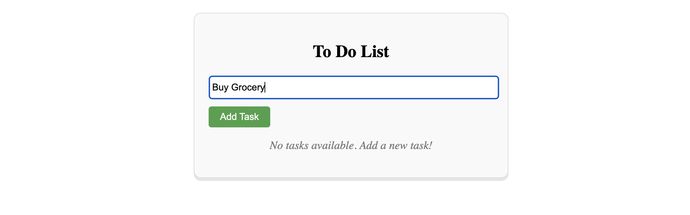
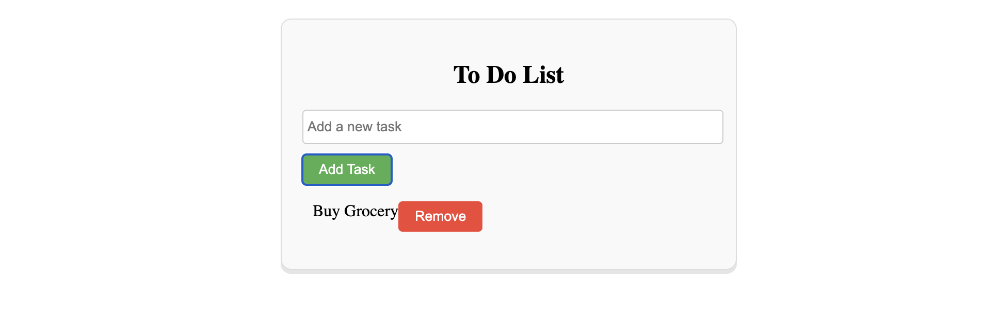

# To Do App

- This is a simple todo application.
- There is one `input field`, one button named `Add Task`, and one button named `Remove` with every tasks.
- After writing something in the input box, and then by clicking _Add Task_ button, the typed text will be displayed in list format with a _Remove_ button for each task.
- By clicking _Remove_ button the task will be removed from the tasks list.
- There is a status text, if there is no task available.
- This project was generated using [Angular CLI](https://github.com/angular/angular-cli) version 19.0.5.

## Project Images





## Project Learnings & Challenges

In this project I have learned & applied,

- _interpolation_,
- _ngModel_ in _FormsModule_ for _two-way data-binding_,
- _ngIf_ `structural directive` in _CommonModule_ for _conditional rendering_
- _ngFor_ `structural directive` in _CommonModule_ for looping in _template_
  of Angular.

## How it works

**A simple dynamic To-Do list in Angular using template-driven forms.**

- _tasks: string[] = []; Holds all the tasks entered by the user. This is the state that controls the list displayed in the UI._
- _newTask: string = ''; Stores the current value of the input field. Bound to the input using [(ngModel)] — enabling two-way data binding._
- _addTask(){}; When the user submits a task (via button or Enter key), this method: Trims the input to avoid empty tasks, Pushes the input into the tasks array, Resets the newTask input to an empty string (clears the input field)._
- _removeTask(index){}; Called when the user clicks a "Remove" button. Removes the task at the given index from the tasks array._
- _Input + Button = Form Controls => [(ngModel)]="newTask" enables two-way binding: Displays the current value of newTask in the input field, Updates newTask in the component whenever the user types, (keyup.enter)="addTask()": calls addTask() when Enter is pressed, (click)="addTask()": calls addTask() when the button is clicked._
- _Using ngIf for conditional rendering_
- _Using ngFor for looping_
- _{{ tasks }} prints the entire array for every li_
- _User clicks "Remove" → `removeTask(i)` runs → Task is removed → Template updates again_

## Data Flow

```bash
                                            User input (in <input>)
                                                  ⇅ [(ngModel)]
                                            Component property (newTask)

                                            (click) or (keyup.enter) ➜ addTask()
                                              ↓
                                            Component updates tasks[]
                                              ↓
                                            Angular DOM updates with *ngFor
```

```bash
                                            Remove button click ➜ removeTask(index)
                                              ↓
                                            Component updates tasks[]
                                              ↓
                                            Angular updates UI (removes <li>)
```

## To-Do App Data Flow Diagram

```bash
                                            ┌─────────────────────────────┐
                                            │       User Types Input      │
                                            │   (e.g., "Buy groceries")   │
                                            └────────────┬────────────────┘
                                                        │
                                                        ▼
                                            ┌─────────────────────────────┐
                                            │ [(ngModel)]="newTask"       │◄─── Two-way binding
                                            │ updates newTask property    │
                                            └────────────┬────────────────┘
                                                        │
                            ┌──────────────┬────────────┴─────────────┬──────────────┐
                            ▼              ▼                          ▼              ▼
                        [Click "Add"]   [Press Enter]        Angular detects changes  (Template updates)
                        (click)         (keyup.enter)             in newTask
                          │                   │                          │
                          └─────► Calls ──────┴─────►  addTask() in Component
                                                        ┌─────────────────────────────┐
                                                        │ Push newTask into tasks[]   │
                                                        │ Clear newTask = ''          │
                                                        └────────────┬────────────────┘
                                                                    │
                                                                    ▼
                                                        Angular triggers DOM update
                                                                    │
                                                                    ▼
                              ┌────────────────────────────────────────────────────────────┐
                              │        <li *ngFor="let task of tasks">                     │
                              │            {{ task }}                                      │
                              │            <button (click)="removeTask(i)">Remove</button> │
                              └────────────────────────────────────────────────────────────┘
                                                                    │
                                                  (Click "Remove" on any task)
                                                                    │
                                                                    ▼
                                                        ┌─────────────────────────────┐
                                                        │ removeTask(i):              │
                                                        │ Remove item from tasks[]    │
                                                        └────────────┬────────────────┘
                                                                    ▼
                                                        Angular re-renders the list

```

## Getting Started

Follow these instructions to get a copy of the project up and running on your local machine for development and testing purposes.

### Prerequisites

Make sure you have the following installed on your system:

- **Node.js:** (Ideally the latest LTS version - check with `node -v`) [Download Node.js](https://nodejs.org/)
- **npm** (usually installed with Node.js - check with `npm -v`) or **yarn** (check with `yarn --version`) [Install Yarn](https://yarnpkg.com/getting-started)
- **Angular CLI:** (Install globally - check with `ng --version`)
  ```bash
  npm install -g @angular/cli
  # or
  yarn global add @angular/cli
  ```
- **Git:** (for version control) [Download Git](https://git-scm.com/)

### Installation

1.  **Clone the repository:**

    ```bash
    git clone https://github.com/sourav-cse-dev/angular-projects.git
    cd 3-todo
    ```

2.  **Install dependencies:**
    Using npm:
    ```bash
    npm install
    ```
    or using yarn:
    ```bash
    yarn install
    ```

## Development Server

To run the development server:

```bash
ng serve -o
```

## License

This project is licensed under the MIT License.

## Contributions

Contributions are welcome! Feel free to open issues or submit pull requests.

## Author

**Sourav Chowdhury**  
Frontend Engineer | Dhaka, Bangladesh

## Contact

You can reach me at [sourav.seu.cse@gmail.com].
