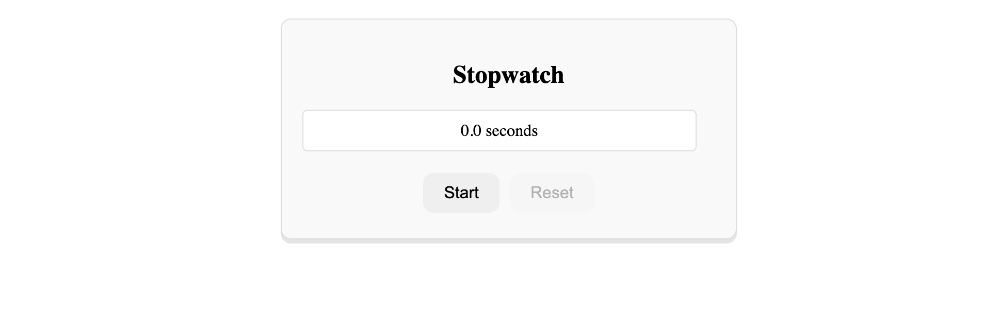
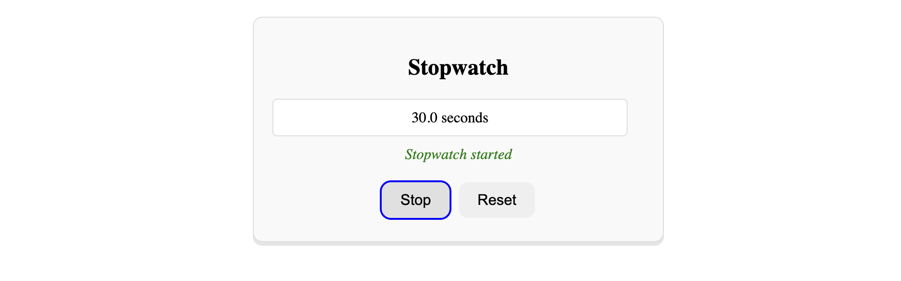
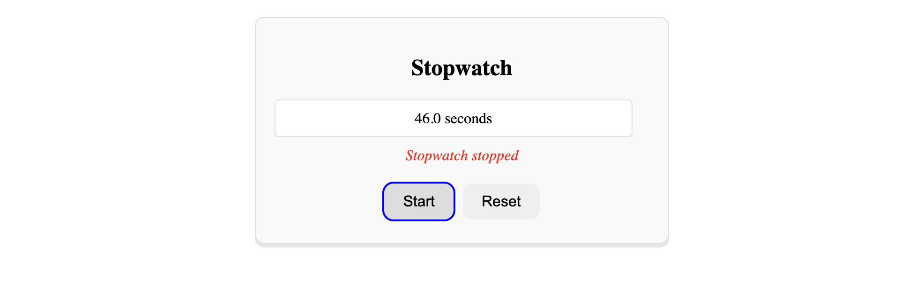
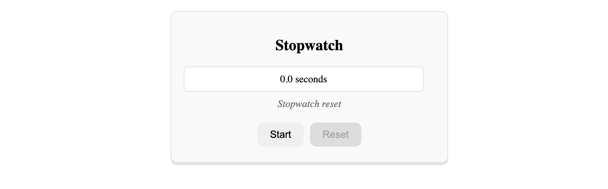

# Stopwatch App

- This is a stopwatch application.
- Component class for state and logic, Template for binding data and events, Pipes for formatting, DOM interaction via setInterval().
- There is a display of `elapsed time` in seconds, a `Start`/`Stop` toggle button, a `Reset` button that clears the time.
- After clicking _Start_ button the timer will be started, _Reset_ button will be enabled; after clicking _Stop_ button the timer will be stopped; after clicking _Reset_ button the timer will be set to 0.
- A status bar based on Start, Stop and Reset.
- This project was generated using [Angular CLI](https://github.com/angular/angular-cli) version 19.0.5.

## Project Images






## Project Learnings & Challenges

In this project I have learned & applied,

- _setInterval()_ from JS; Schedules repeated execution of callback every delay milliseconds,
- _clearInterval()_ from JS; Cancels a Timeout object created by setInterval(),
- _ternary operator_ from JS; Function call based on condition,
- _Pipe_ in _CommonModule_ for _formatting data_
- _ngClass_ in _CommonModule_ for adding and removing CSS classes on an HTML element.
  of Angular.

## How it works

**A Stopwatch component in Angular using setInterval() & clearInterval().**

- _elapsedTime = 0; tracks how many tenths of seconds (every 100ms) have passed._
- _isRunning = false; boolean flag indicating if the stopwatch is active._
- _intervalRef: any; reference to the interval timer, used to stop it later._
- _status = ''; A string to indicate the current status ("Stopwatch started", "Stopwatch stopped", "Stopwatch reset")._
- _startStop(){}; This method is connected to the Start/Stop button via (click)="startStop()". It toggles between starting and stopping the stopwatch based on the isRunning flag._
- _start(){}; setInterval starts a loop every 100ms (0.1s), elapsedTime is incremented by 1 every tick, It means after 10 ticks, the display shows 1.0 seconds, Updates status to "Stopwatch started"_
- _stop(){}; Sets the flag to false, Stops the timer using clearInterval(), Updates status to "Stopwatch stopped"._
- _reset(){}; Stops the timer and resets elapsedTime to 0, Updates status to "Stopwatch reset"_
- _{{ elapsedTime | number : "1.1-1" }}; Uses Angular's number pipe, "1.1-1": Formats the number with 1 digit before the decimal, and exactly 1 digit after (e.g. 1.3, 4.7), So elapsedTime = 15 → displayed as 1.5 seconds._
- _{{ isRunning ? "Stop" : "Start" }}; Dynamic label: If running, show "Stop"; otherwise "Start"._
- _[disabled]="!elapsedTime"; Disables the reset button when elapsedTime = 0._

## Data Flow

```bash
                        | Direction         | Data/Action                                       |
                        | ----------------- | ------------------------------------------------- |
                        | UI → Component    | Button clicks trigger `startStop()` or `reset()`  |
                        | Component → UI    | `elapsedTime` changes → DOM updates automatically |
                        | Timer → Component | `setInterval()` modifies `elapsedTime`            |
                        | Component → UI    | Angular updates UI using interpolation and pipes  |

```

## Data Flow Diagram

```bash
                                           ┌──────────────────────────────┐
                                           │         User Action          │
                                           │     Clicks "Start" Button    │
                                           └────────────┬─────────────────┘
                                                        │
                                                        ▼
                                           ┌──────────────────────────────┐
                                           │     startStop() method       │
                                           └────────────┬─────────────────┘
                                                        │
         ┌──────────────────────────────────────────────┴───────────────────────────────────────────┐
         ▼                                                                                          ▼
 ┌──────────────────────────────┐                                                 ┌────────────────────────────┐
 │ isRunning is false           │                                                 │ isRunning is true          │
 │ └── Call start()             │                                                 │ └── Call stop()            │
 └────────────┬─────────────────┘                                                 └────────────┬───────────────┘
              │                                                                                │
              ▼                                                                                ▼
 ┌──────────────────────────────┐                                                 ┌─────────────────────────────┐
 │ setInterval every 100ms      │                                                 │ clearInterval()             │
 │ └── elapsedTime += 1         │                                                 │ isRunning = false           │
 │ isRunning = true             │                                                 │ status = "Stopwatch stopped"│
 │ status = "Stopwatch started" │                                                 │ Update UI                   │
 │ Angular change detection     │                                                 └────────────┬────────────────┘
 └────────────┬─────────────────┘                                                              │
              │                                                                                ▼
              ▼
 ┌────────────────────────────────────────────────────────────────────────────────────────────────────────────────┐
 │ - <p>{{ elapsedTime | number:'1.1-1' }}</p>                                                                    │
 │ - Button label changes via {{ isRunning ? 'Stop' : 'Start' }}                                                  │
 │ - Status bar updates with {{ status }}                                                                         │
 │ - Class bound via ngClass: started → green, stopped → red                                                      │
 └────────────────────────────────────────────────────────────────────────────────────────────────────────────────┘


                                           ┌──────────────────────────────┐
                                           │         User Action          │
                                           │     Clicks "Reset" Button    │
                                           └────────────┬─────────────────┘
                                                        ▼
                                           ┌──────────────────────────────┐
                                           │     reset() method           │
                                           └────────────┬─────────────────┘
                                                        │
                                                        ▼
                                           ┌──────────────────────────────┐
                                           │ clearInterval()              │
                                           │ elapsedTime = 0              │
                                           │ isRunning = false            │
                                           │ status = "Stopwatch reset"   │
                                           └────────────┬─────────────────┘
                                                        ▼
                                           ┌──────────────────────────────────────────────────────────────┐
                                           │ Angular updates UI:                                          │
                                           │ - Timer resets to 0                                          │
                                           │ - Reset button disabled if !elapsedTime                      │
                                           │ - Status bar shows "Stopwatch reset"                         │
                                           └──────────────────────────────────────────────────────────────┘

```

## Getting Started

Follow these instructions to get a copy of the project up and running on your local machine for development and testing purposes.

### Prerequisites

Make sure you have the following installed on your system:

- **Node.js:** (Ideally the latest LTS version - check with `node -v`) [Download Node.js](https://nodejs.org/)
- **npm** (usually installed with Node.js - check with `npm -v`) or **yarn** (check with `yarn --version`) [Install Yarn](https://yarnpkg.com/getting-started)
- **Angular CLI:** (Install globally - check with `ng --version`)
  ```bash
  npm install -g @angular/cli
  # or
  yarn global add @angular/cli
  ```
- **Git:** (for version control) [Download Git](https://git-scm.com/)

### Installation

1.  **Clone the repository:**

    ```bash
    git clone https://github.com/sourav-cse-dev/angular-projects.git
    cd 4-stopwatch
    ```

2.  **Install dependencies:**
    Using npm:
    ```bash
    npm install
    ```
    or using yarn:
    ```bash
    yarn install
    ```

## Development Server

To run the development server:

```bash
ng serve -o
```

## License

This project is licensed under the MIT License.

## Contributions

Contributions are welcome! Feel free to open issues or submit pull requests.

## Author

**Sourav Chowdhury**  
Frontend Engineer | Dhaka, Bangladesh

## Contact

You can reach me at [sourav.seu.cse@gmail.com].
